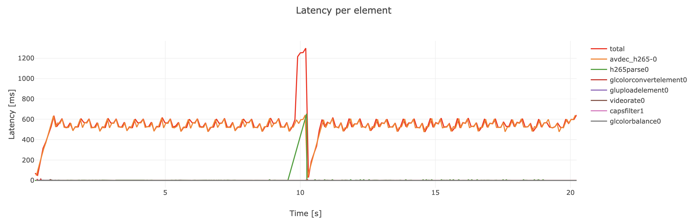

# GStreamer Latency Plotter

A small node.js program that allows you to calculate and display the latency of each element of the GStreamer pipeline while using the GStreamer [Tracing](https://gstreamer.freedesktop.org/documentation/additional/design/tracing.html?gi-language=c#latency) subsystem.

## How to use

1. Install `npm install`
2. Run your GStreamer pipeline using the latency tracer and store the traces in a file like this:

        GST_DEBUG_COLOR_MODE=off GST_TRACERS="latency(flags=pipeline+element)" GST_DEBUG=GST_TRACER:7 GST_DEBUG_FILE=traces.log

3. Run `node main.js traces.log` on that logfile. Check `-h` on more options.

## Examples

Decode and render the HEVC bitstream `file.265`:

    GST_DEBUG_COLOR_MODE=off GST_TRACERS="latency(flags=pipeline+element)" GST_DEBUG=GST_TRACER:7 GST_DEBUG_FILE=traces.log gst-launch-1.0 filesrc location=file.265 ! video/x-h265  ! h265parse ! avdec_h265 ! videorate ! video/x-raw,framerate=25/1 ! autovideosink

Plot the results:

    node main.js traces.log

Which returns you a table like this:

And creates an interactive plot of the latency over time in your web browser window like this:

In this example we have a file where after 10 seconds we swith the aspect ratio of the video, which shows that the `h265parse` element introduces approx. 600 ms of extra latency.

You can find `file.265` and the corresponding `traces.log` from this example in the `testdata` folder.
